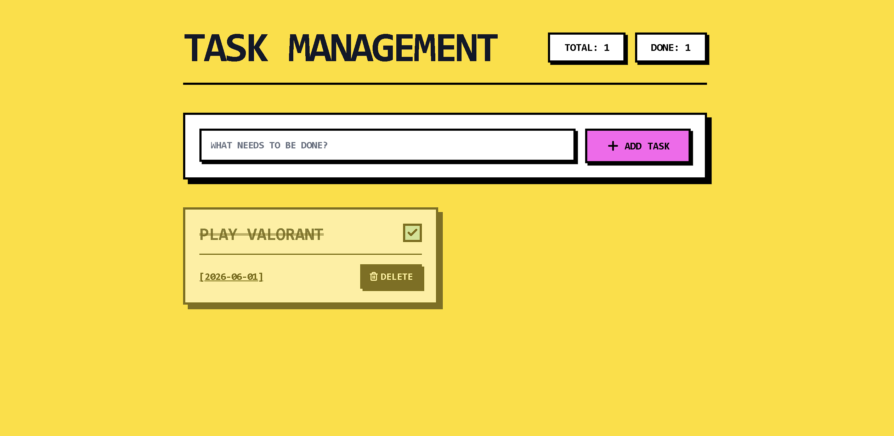
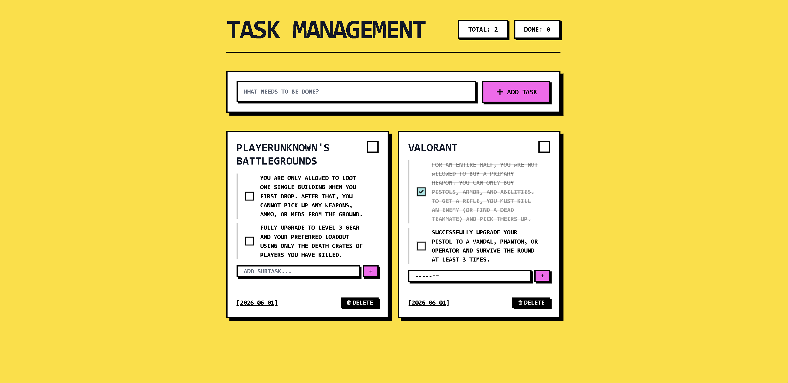

# Retro Task Management

A bold, comic-book inspired task management application built with React, Vite, and Tailwind CSS.

## Demo 1


## Demo 2


## Features

- **Stylized UI**: Unique retro aesthetic with bold outlines and vibrant colors.
- **Task Tracking**: Real-time counters for total and completed tasks.
- **Task Management**:
    - Add new tasks with ease.
    - Mark tasks as complete/incomplete.
    - Delete tasks.
    - Automatically captures the creation date.
- **Subtasks**:
    - Add multiple small tasks within each main task.
    - Individual completion toggles for subtasks.
    - Delete individual subtasks.

## Getting Started

### Prerequisites

- Node.js (Latest LTS recommended)
- npm

### Installation

1. Clone the repository
2. Install dependencies:
   ```bash
   npm install
   ```

### Running the Application

Start the development server:
```bash
npm run dev
```

The application will be available at `http://localhost:3000`.

## Tech Stack

- **Frontend**: React 19
- **Styling**: Tailwind CSS
- **Build Tool**: Vite
- **Icons**: Lucide React
- **Animations**: Motion
